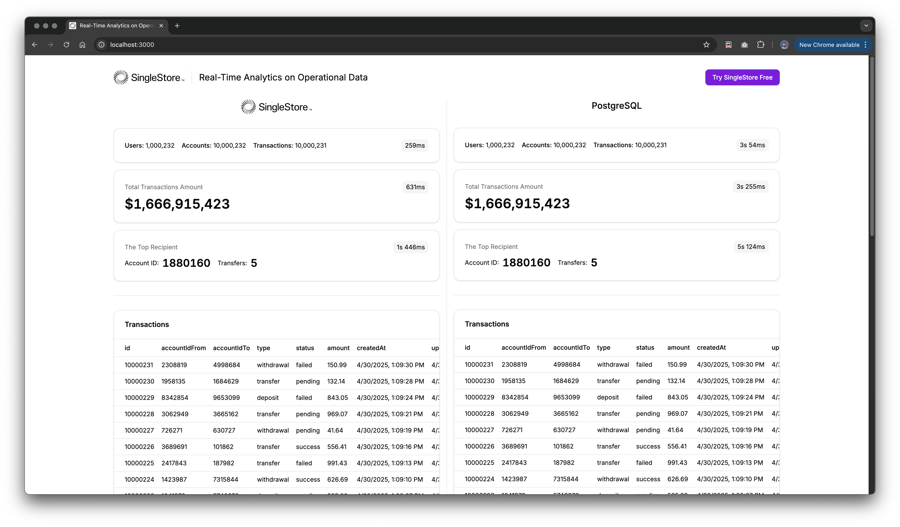

# Demo: Real Time Analytics on Operational Data

The app demonstrates the performance difference between SingleStore, MySQL and PostgreSQL in real-time analytics on operational data. It is a demo application built using the SingleStore Free Dev image, a MySQL image, and a PostgreSQL image.

## Getting Started

1. Install and launch [Docker Desktop](https://www.docker.com/products/docker-desktop/).
2. Open a terminal in the root directory of the project and install dependencies by running: `npm i`.
3. In the `./apps/db` directory, create a `.env` file based on `.env.example`.
4. Start the Docker containers by running: `make up`.
5. Wait 5–10 seconds, then initialize the `singlestore` image by running: `make singlestore-init`.
6. In the `./packages/singlestore`, `./packages/postgres`, and `./packages/mysql` directories, create `.env` files based on the corresponding `.env.example` files.
7. From the root directory of the project, push the database schemas by running: `npm run db:push`.

## Generating and Loading Data

1. In the `./apps/data-generator` directory, create a `.env` file based on `.env.example`.
2. Generate data (10M+ records) by running: `npm run generate:start`.
3. Load the data by running: `npm run load:start`.
4. Create indexes by running: `npm run indexes:create`.

## Running the App

1. In the `./apps/client`, and `./apps/server` directories, create `.env` files based on the corresponding `.env.example` files.
2. Build and start the app by running in the root of the project: `npm run build && npm run start`.
3. Open [http://localhost:3000](http://localhost:3000) in your browser.

---

[Start With SingleStore – $600 in Free Credits](https://portal.singlestore.com/intention/cloud?utm_source=yaroslav&utm_medium=github&utm_campaign=general-technical&utm_content=real-time-analytics-on-operational-data-why-singlestore-outperforms-traditional-postgres-setups)
